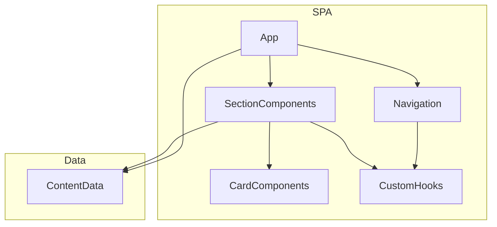
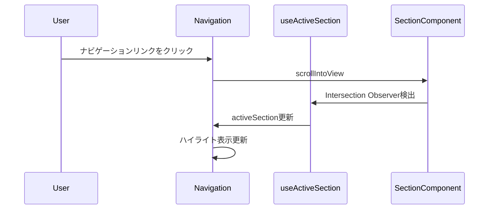
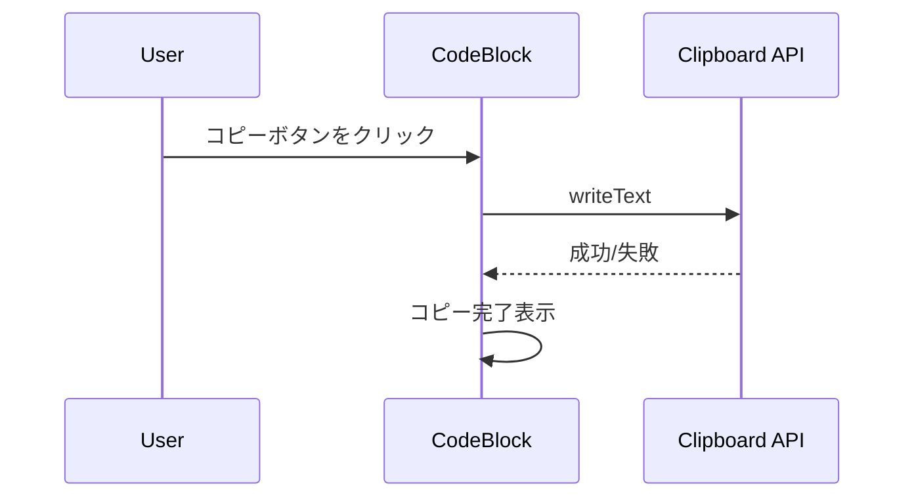

# Design Document: Spec Kit ドキュメント SPA

## Overview

**Purpose**: Spec-Driven Development（SDD）のワークフローとSpec Kitの使用方法を開発者に説明するシングルページアプリケーション（SPA）を提供する。

**Users**: SDDを学習・実践する開発者が、ワークフローの理解、コマンドリファレンスの参照、EARS形式の学習に活用する。

**Impact**: 既存の`spa/`ディレクトリに新規SPAを構築。プロジェクトの技術スタック（Vite + TypeScript）に準拠。

### Goals
- SDDの3フェーズワークフローを視覚的に説明
- Spec Kitコマンドの完全なリファレンスを提供
- EARS形式の書き方を例示で教育
- レスポンシブでインタラクティブなナビゲーション

### Non-Goals
- バックエンドAPI連携（静的コンテンツのみ）
- 多言語対応（日本語のみ）
- ユーザー認証・データ永続化

## Architecture

> 詳細な調査結果は `research.md` を参照。

### Architecture Pattern & Boundary Map



**Architecture Integration**:
- **選定パターン**: Plain React + Hooks（シンプルなドキュメントSPAに最適）
- **ドメイン境界**: UI層（コンポーネント）とデータ層（コンテンツ定義）の分離
- **既存パターン維持**: Vite + TypeScript strict、Biomeリント、ESM-first
- **新規コンポーネント根拠**: 教育用SPAとして独立したUI構成が必要

### Technology Stack & Alignment

| Layer | Choice / Version | Role in Feature | Notes |
|-------|------------------|-----------------|-------|
| Frontend | React 19.x | UIコンポーネント | react-jsx設定済み |
| Language | TypeScript 5.x | 型安全性 | strict mode |
| Bundler | Vite 6.x | ビルド・開発サーバー | 既存設定を拡張 |
| Styling | CSS Modules | スコープ付きスタイル | 追加依存なし |
| Runtime | Node.js 22 | 開発環境 | 既存要件 |

## System Flows

### ナビゲーションフロー



### コードコピーフロー



## Requirements Traceability

| Requirement | Summary | Components | Interfaces | Flows |
|-------------|---------|------------|------------|-------|
| 1.1 | SDDフェーズ表示 | WorkflowSection, PhaseCard | - | - |
| 1.2 | フェーズ説明 | PhaseCard | - | - |
| 1.3 | スムーズスクロール | Navigation, useActiveSection | - | ナビゲーションフロー |
| 2.1 | コマンド一覧 | CommandSection, CommandCard | - | - |
| 2.2 | ホバー詳細表示 | CommandCard | - | - |
| 2.3 | コードコピー | CodeBlock | ClipboardService | コードコピーフロー |
| 3.1 | 承認ワークフロー図解 | ApprovalSection | - | - |
| 3.2 | レビュー必要性説明 | ApprovalSection | - | - |
| 3.3 | -yオプション説明 | ApprovalSection | - | - |
| 4.1 | Steering/Specs比較表 | ConceptSection | - | - |
| 4.2 | Steering説明 | ConceptSection | - | - |
| 4.3 | Specs説明 | ConceptSection | - | - |
| 5.1 | 固定ヘッダー | Header, Navigation | - | - |
| 5.2 | スクロール連動ハイライト | Navigation, useActiveSection | - | ナビゲーションフロー |
| 5.3 | レスポンシブ対応 | All Components | - | - |
| 6.1 | EARS説明 | EarsSection | - | - |
| 6.2 | パターン例示 | EarsSection, PatternCard | - | - |
| 6.3 | パターン選択表示 | EarsSection, PatternCard | - | - |
| 7.1-7.4 | 技術スタック | - | - | - |

## Components and Interfaces

### コンポーネントサマリー

| Component | Domain/Layer | Intent | Req Coverage | Key Dependencies | Contracts |
|-----------|--------------|--------|--------------|------------------|-----------|
| App | Entry | アプリケーションルート | All | Header, Sections (P0) | - |
| Header | UI/Layout | 固定ヘッダー | 5.1 | Navigation (P0) | - |
| Navigation | UI/Layout | ナビゲーションメニュー | 1.3, 5.1, 5.2 | useActiveSection (P0) | State |
| WorkflowSection | UI/Content | SDDワークフロー説明 | 1.1, 1.2 | PhaseCard (P1) | - |
| CommandSection | UI/Content | コマンドリファレンス | 2.1, 2.2 | CommandCard (P1) | - |
| ApprovalSection | UI/Content | 承認ワークフロー説明 | 3.1, 3.2, 3.3 | - | - |
| ConceptSection | UI/Content | Steering/Specs説明 | 4.1, 4.2, 4.3 | - | - |
| EarsSection | UI/Content | EARS形式説明 | 6.1, 6.2, 6.3 | PatternCard (P1) | - |
| CodeBlock | UI/Shared | コピー可能コードブロック | 2.3 | Clipboard API (P0) | Service |
| useActiveSection | Hooks | スクロール状態管理 | 5.2 | Intersection Observer (P0) | State |

---

### UI/Layout

#### Header

| Field | Detail |
|-------|--------|
| Intent | 固定ヘッダーとナビゲーションのコンテナ |
| Requirements | 5.1 |

**Responsibilities & Constraints**
- 画面上部に固定表示
- Navigationコンポーネントをラップ
- レスポンシブ時のハンバーガーメニュー制御

**Dependencies**
- Inbound: App — ルートからレンダリング (P0)
- Outbound: Navigation — ナビゲーション表示 (P0)

**Contracts**: State [ ]

---

#### Navigation

| Field | Detail |
|-------|--------|
| Intent | セクションナビゲーションとアクティブ状態表示 |
| Requirements | 1.3, 5.1, 5.2 |

**Responsibilities & Constraints**
- セクションリンクの表示
- アクティブセクションのハイライト
- クリック時のスムーズスクロール

**Dependencies**
- Inbound: Header — レンダリング (P0)
- Outbound: useActiveSection — 現在のセクション取得 (P0)
- External: DOM scrollIntoView — スクロール制御 (P0)

**Contracts**: State [x]

##### State Management
```typescript
interface NavigationState {
  activeSection: string;
  isMobileMenuOpen: boolean;
}
```
- State model: activeSection（現在表示中のセクションID）、isMobileMenuOpen（モバイルメニュー開閉）
- Persistence: なし（セッション内のみ）

---

### UI/Content

#### WorkflowSection

| Field | Detail |
|-------|--------|
| Intent | SDDの3フェーズワークフローを視覚的に表示 |
| Requirements | 1.1, 1.2 |

**Responsibilities & Constraints**
- Requirements → Design → Tasks フローの図示
- 各フェーズの目的・成果物を説明
- PhaseCardを使用した詳細表示

**Dependencies**
- Inbound: App — セクションとしてレンダリング (P0)
- Outbound: PhaseCard — フェーズ詳細表示 (P1)

---

#### CommandSection

| Field | Detail |
|-------|--------|
| Intent | Spec Kitコマンドの一覧と詳細を表示 |
| Requirements | 2.1, 2.2 |

**Responsibilities & Constraints**
- 主要コマンドのカード表示
- ホバー時の詳細説明表示
- CodeBlockによるコピー可能な例示

**Dependencies**
- Inbound: App — セクションとしてレンダリング (P0)
- Outbound: CommandCard — コマンド詳細表示 (P1)
- Outbound: CodeBlock — コード例表示 (P1)

---

#### EarsSection

| Field | Detail |
|-------|--------|
| Intent | EARS形式の5パターンを説明・例示 |
| Requirements | 6.1, 6.2, 6.3 |

**Responsibilities & Constraints**
- Event-Driven, State-Driven, Unwanted Behavior, Optional Feature, Ubiquitousの説明
- 各パターンのテンプレートと実例表示
- パターン選択時のインタラクティブ表示

**Dependencies**
- Inbound: App — セクションとしてレンダリング (P0)
- Outbound: PatternCard — パターン詳細表示 (P1)

---

### UI/Shared

#### CodeBlock

| Field | Detail |
|-------|--------|
| Intent | コピー機能付きコードブロック |
| Requirements | 2.3 |

**Responsibilities & Constraints**
- コード表示とシンタックスハイライト（オプション）
- コピーボタンの表示
- コピー成功/失敗のフィードバック

**Dependencies**
- Inbound: CommandSection, EarsSection — コード例表示 (P1)
- External: Clipboard API — テキストコピー (P0)

**Contracts**: Service [x]

##### Service Interface
```typescript
interface ClipboardService {
  copyToClipboard(text: string): Promise<CopyResult>;
}

type CopyResult = 
  | { success: true }
  | { success: false; error: string };
```
- Preconditions: HTTPS/localhost環境
- Postconditions: クリップボードにテキストがコピーされる
- Invariants: コピー失敗時はエラーメッセージを返す

---

### Hooks

#### useActiveSection

| Field | Detail |
|-------|--------|
| Intent | スクロール位置に基づくアクティブセクション検出 |
| Requirements | 5.2 |

**Responsibilities & Constraints**
- Intersection Observerによるセクション可視性監視
- 最も可視面積の大きいセクションをアクティブとして返却
- パフォーマンス考慮（throttle/debounce）

**Dependencies**
- Inbound: Navigation — アクティブセクション取得 (P0)
- External: Intersection Observer API — 可視性検出 (P0)

**Contracts**: State [x]

##### State Management
```typescript
interface UseActiveSectionOptions {
  sectionIds: readonly string[];
  rootMargin?: string;
  threshold?: number;
}

interface UseActiveSectionReturn {
  activeSection: string;
  scrollToSection: (sectionId: string) => void;
}
```
- State model: activeSection（現在アクティブなセクションID）
- Persistence: なし
- Concurrency: Observerコールバックで自動更新

**Implementation Notes**
- Integration: Intersection ObserverのクリーンアップをuseEffect内で実装
- Validation: sectionIdsが空の場合は最初のセクションをデフォルト
- Risks: 高頻度スクロールでのパフォーマンス → threshold調整で対応

---

## Data Models

### Domain Model

#### コンテンツデータ構造

```typescript
// フェーズ情報
interface Phase {
  id: string;
  title: string;
  description: string;
  outputs: readonly string[];
  icon: string;
}

// コマンド情報
interface Command {
  id: string;
  name: string;
  description: string;
  syntax: string;
  parameters: readonly Parameter[];
  examples: readonly CodeExample[];
}

interface Parameter {
  name: string;
  type: string;
  required: boolean;
  description: string;
}

interface CodeExample {
  title: string;
  code: string;
  language: string;
}

// EARSパターン
interface EarsPattern {
  id: string;
  name: string;
  pattern: string;
  description: string;
  examples: readonly string[];
}

// セクションナビゲーション
interface Section {
  id: string;
  title: string;
  icon?: string;
}
```

**Business Rules & Invariants**:
- すべてのIDはユニーク
- Commandは最低1つのexampleを持つ
- EarsPatternは5種類固定

### Data Contracts & Integration

**API Data Transfer**: なし（静的コンテンツ）

**データファイル構成**:
```
spa/src/
├── data/
│   ├── phases.ts        # Phase[]
│   ├── commands.ts      # Command[]
│   ├── ears-patterns.ts # EarsPattern[]
│   └── sections.ts      # Section[]
```

## Error Handling

### Error Strategy
- クライアントサイドのみのため、主にUI状態でのエラー表示
- Clipboard APIの失敗はトースト通知

### Error Categories and Responses
- **User Errors**: 該当なし（入力フォームなし）
- **System Errors**: Clipboard API失敗 → フォールバックメッセージ表示
- **Business Logic Errors**: 該当なし

## Testing Strategy

### Unit Tests
- `useActiveSection`: Intersection Observer モック、セクション切り替え
- `ClipboardService`: コピー成功/失敗ケース
- コンテンツデータ: 型定義との整合性

### Integration Tests
- Navigation → Section: クリック時のスクロール動作
- CodeBlock → Clipboard: コピー機能のE2E

### E2E/UI Tests
- ナビゲーションリンク → セクション表示
- モバイルメニュー開閉
- コードブロックコピー

## Security Considerations

- **XSS**: Reactの自動エスケープにより対応
- **Clipboard API**: HTTPS環境でのみ動作（開発環境はlocalhost）
- **外部依存**: なし（静的コンテンツのみ）

## Performance & Scalability

- **ターゲット**: 初期ロード < 2秒、FCP < 1秒
- **最適化**: コード分割は不要（単一ページ）、CSS Modulesで未使用スタイル除去
- **スケーリング**: 静的サイトのため、CDN配信で対応可能
