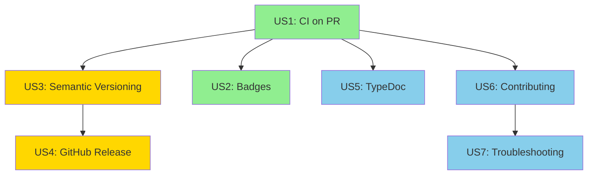

# Implementation Plan: CI/CD and Documentation Enhancement

**Branch**: `001-ci-cd-docs` | **Date**: 2026-01-11 | **Spec**: [spec.md](spec.md)  
**Input**: Feature specification from `/specs/001-ci-cd-docs/spec.md`

## Summary

Implement automated quality checks, semantic versioning, GitHub releases, and comprehensive documentation for the TypeScript Web App development template. The primary goal is to ensure code quality through automated CI/CD pipelines while providing clear documentation for contributors and users. This enhancement will enforce the Constitution's quality gates (80% coverage) automatically and reduce manual versioning overhead through semantic-release.

**Technical Approach**: Use GitHub Actions for CI/CD workflows, semantic-release for automated versioning, TypeDoc for API documentation generation, and structured markdown files for contribution guidelines and troubleshooting. All automation will integrate with existing pnpm/Biome/Vitest toolchain without introducing conflicting tools.

## Technical Context

**Language/Version**: TypeScript 5.7.3, Node.js 22.21.1  
**Primary Dependencies**: 
- GitHub Actions (CI/CD platform)
- semantic-release 24.x (automated versioning)
- TypeDoc 0.27.x (API documentation)
- Existing: Vite 6.x, Vitest 2.x, Biome 1.9.x, pnpm 9.x

**Storage**: Git repository (GitHub), no database required  
**Testing**: Vitest with @vitest/coverage-v8, integration tests for CI workflows  
**Target Platform**: GitHub Actions runners (Linux, ubuntu-latest), Documentation hosted on GitHub Pages (optional)  
**Project Type**: Single project (template repository)  
**Performance Goals**: 
- CI pipeline completes in < 3 minutes
- TypeDoc generation < 10 seconds
- Badge rendering < 500ms

**Constraints**: 
- Must use GitHub Actions (no external CI)
- Public repository (badges assume public visibility)
- No npm publishing (template, not library)
- Must maintain Constitution compliance (80% coverage, strict typing)

**Scale/Scope**: 
- 7 user stories (P1: 2, P2: 2, P3: 3)
- ~5 GitHub Actions workflow files
- ~3 documentation files (CONTRIBUTING.md, TypeDoc config, README updates)

## Constitution Check

*GATE: Must pass before Phase 0 research. Re-check after Phase 1 design.*

### Initial Check (Pre-Phase 0)

- [x] **Test-First Development**: Test specifications created and user-approved before implementation
  - ✅ spec.md contains acceptance scenarios for each user story
  - ✅ CI workflows can be tested by creating test PRs
  - ✅ Documentation can be validated by following guides
  
- [x] **TypeScript Strict Mode**: All code uses strict typing, no unexplained `any` types
  - ✅ No new TypeScript code required (configuration files only)
  - ✅ Existing codebase already uses strict mode
  
- [x] **ESM-First**: All imports use ESM syntax with explicit extensions
  - ✅ No new module imports required
  - ✅ Configuration files use JSON/YAML (no JS modules)
  
- [x] **Quality Gates**: 80%+ test coverage, build/test/lint performance within limits
  - ✅ CI workflow will enforce 80% coverage automatically
  - ✅ Current coverage: 100% (will maintain through CI checks)
  
- [x] **Documentation Through Tests**: Tests serve as specifications, working docs archived on merge
  - ✅ CI workflow outputs serve as test results
  - ✅ CONTRIBUTING.md will document TDD workflow from Constitution
  - ✅ Design notes for this feature will be archived per Constitution V

### Post-Phase 1 Re-evaluation (2026-01-12)

- [x] **Test-First Development**: Contracts define testable specifications
  - ✅ ci-workflow.yml contract includes validation checklist
  - ✅ release-workflow.yml contract includes testing strategy (dry-run examples)
  - ✅ quickstart.md provides local testing procedures (act, semantic-release --dry-run)
  - ✅ All workflows can be tested before implementation
  
- [x] **TypeScript Strict Mode**: No new TypeScript code introduced
  - ✅ All artifacts are YAML/Markdown configuration files
  - ✅ Existing strict mode unchanged
  
- [x] **ESM-First**: No module changes required
  - ✅ semantic-release plugins will be ESM-compatible
  - ✅ No CommonJS dependencies introduced
  
- [x] **Quality Gates**: Automated enforcement designed
  - ✅ CI workflow contract specifies 3 parallel jobs (test, lint, build)
  - ✅ Performance targets defined: < 3min total CI time
  - ✅ Coverage check automated (vitest coverage command in CI)
  - ✅ Badge specifications include coverage threshold colors (80-100% green)
  
- [x] **Documentation Through Tests**: Contracts serve as executable specs
  - ✅ Workflow contracts define exact structure for implementation
  - ✅ quickstart.md enables local validation before push
  - ✅ CONTRIBUTING.md outline includes TDD workflow section
  - ✅ research.md will be archived to docs/archive/ on PR merge

**Status**: ✅ All Constitution principles maintained through Phase 1 design

## Project Structure

### Documentation (this feature)

```text
specs/001-ci-cd-docs/
├── plan.md              # This file
├── spec.md              # User-approved specification
├── research.md          # Phase 0 output (semantic-release investigation)
├── quickstart.md        # Phase 1 output (CI setup guide)
├── contracts/           # Phase 1 output (workflow schemas)
│   ├── ci-workflow.yml  # Sample CI workflow structure
│   └── release-workflow.yml  # Sample release workflow structure
└── tasks.md             # Phase 2 output (generated by /speckit.tasks)
```

### Source Code (repository root)

```text
# Existing structure (unchanged)
src/
tests/

# New CI/CD files
.github/
├── workflows/
│   ├── ci.yml           # PR and main push checks (P1)
│   ├── release.yml      # Semantic release workflow (P2)
│   └── docs.yml         # TypeDoc generation (P3, optional)
└── CONTRIBUTING.md      # Contribution guidelines (P3)

# New documentation
docs/
├── api/                 # TypeDoc output (P3)
│   └── index.html       # Generated API docs
└── archive/             # Existing - for archived design docs
    └── 2026-01-11-001-ci-cd-docs/
        └── research.md  # This feature's research (archived on merge)

# Updated files
README.md                # Add badges and troubleshooting (P1, P3)
package.json             # Add semantic-release and TypeDoc dependencies (P2, P3)
.releaserc.json          # Semantic-release configuration (P2)
typedoc.json             # TypeDoc configuration (P3)
```

## Phase 0: Research & Investigation

**Objective**: Validate technical choices and identify potential blockers before implementation.

### Research Questions

1. **GitHub Actions Workflow Best Practices**
   - Question: What's the optimal caching strategy for pnpm in GitHub Actions?
   - Why: Faster CI = better developer experience
   - Method: Review GitHub Actions documentation and pnpm-specific actions
   - Success: Identify recommended actions and configuration

2. **Semantic-Release Configuration**
   - Question: Which semantic-release plugins are needed for our use case (no npm publish)?
   - Why: Avoid unnecessary plugins, keep config minimal
   - Method: Review semantic-release docs, test with sample commits
   - Success: Define minimal plugin set and configuration

3. **Coverage Badge Integration**
   - Question: Can we use Shields.io with GitHub Actions artifacts, or do we need Codecov?
   - Why: Prefer self-hosted solutions, avoid external service dependencies
   - Method: Test both approaches with sample workflow
   - Success: Determine badge URL pattern and any required tokens

4. **TypeDoc Integration with Vite**
   - Question: Does TypeDoc require special configuration for Vite projects?
   - Why: Ensure documentation generation doesn't conflict with build process
   - Method: Review TypeDoc docs, test with current tsconfig.json
   - Success: Confirm TypeDoc works with existing setup

### Research Outputs

**File**: `research.md` (created in this directory)

**Contents**:
- Recommended GitHub Actions for pnpm caching
- Minimal semantic-release plugin configuration
- Badge URL patterns and examples
- TypeDoc configuration sample
- Any discovered blockers or risks

## Phase 1: Design & Contracts

**Objective**: Define concrete interfaces and data structures before implementation.

### 1.1 CI Workflow Contract

**File**: `contracts/ci-workflow.yml`

**Purpose**: Define the exact structure of the CI workflow that will run on PRs and main pushes.

**Contract Elements**:
- Workflow name: "CI"
- Triggers: pull_request (to main), push (to main)
- Jobs: test, lint, build, coverage
- Node version: 22.x
- Outputs: test results, coverage percentage, build artifacts (if any)

### 1.2 Release Workflow Contract

**File**: `contracts/release-workflow.yml`

**Purpose**: Define the semantic-release workflow structure.

**Contract Elements**:
- Workflow name: "Release"
- Trigger: push to main (after CI passes)
- Jobs: semantic-release
- Outputs: new version tag, CHANGELOG update, GitHub Release

### 1.3 Badge Specification

**File**: `contracts/badges.md`

**Purpose**: Document exact badge URLs and expected behavior.

**Contract Elements**:
- Build status badge (Shields.io with GitHub Actions)
- Coverage badge (format TBD from research)
- Version badge (Shields.io with GitHub Releases)
- License badge (static Shields.io)
- Node version badge (static Shields.io)

### 1.4 CONTRIBUTING.md Outline

**File**: `contracts/contributing-outline.md`

**Purpose**: Define sections and content structure before writing.

**Contract Elements**:
- Section list (Prerequisites, Getting Started, Development Workflow, etc.)
- Required content for each section
- Examples to include (commit messages, test commands)

### 1.5 Quickstart Guide

**File**: `quickstart.md`

**Purpose**: Provide step-by-step guide for setting up and testing CI/CD locally.

**Contents**:
- How to test CI workflow locally (using act or manual verification)
- How to test semantic-release (dry-run mode)
- How to verify badge rendering
- Common troubleshooting steps

## Phase 2: Implementation Roadmap

**Note**: Detailed tasks will be generated by `/speckit.tasks` command.

### Iteration 1: P1 Features (MVP)
**Goal**: Basic CI/CD and project health visibility

**User Stories**: 
- US1: Automated Quality Checks on PR
- US2: README Status Badges

**Deliverables**:
- `.github/workflows/ci.yml` (functional)
- README.md with badges
- Verified: CI runs on test PR, badges display correctly

**Estimated Effort**: ~2-3 hours
**Testing**: Create test PR, verify all checks run and badges update

---

### Iteration 2: P2 Features (Automation)
**Goal**: Automated versioning and releases

**User Stories**:
- US3: Automatic Semantic Versioning
- US4: Automatic GitHub Release Creation

**Deliverables**:
- `.releaserc.json` (semantic-release config)
- `.github/workflows/release.yml` (functional)
- CHANGELOG.md (auto-generated)
- Verified: Conventional commit triggers version bump and release

**Estimated Effort**: ~2-3 hours
**Testing**: Make conventional commits (feat, fix, breaking), verify versions and releases

---

### Iteration 3: P3 Features (Documentation)
**Goal**: Comprehensive developer documentation

**User Stories**:
- US5: API Documentation Generation
- US6: Contribution Guidelines
- US7: README Troubleshooting Section

**Deliverables**:
- `typedoc.json` + `package.json` script
- `CONTRIBUTING.md` (complete)
- README.md troubleshooting section
- `docs/api/` (generated TypeDoc output)
- Verified: All documentation is accurate and helpful

**Estimated Effort**: ~2-3 hours
**Testing**: Follow CONTRIBUTING.md from scratch, verify each documented step works

## Dependencies Between User Stories



**Legend**:
- 🟢 Green (P1): Must complete first
- 🟡 Yellow (P2): Requires P1
- 🔵 Blue (P3): Independent, can do anytime after P1

## Risk Assessment

### High Risk
- **GitHub Actions permissions**: Fork PRs have restricted permissions
  - Mitigation: Document limitations, test with fork PR
  - Fallback: Badge may not update for fork PRs (acceptable)

### Medium Risk
- **Semantic-release learning curve**: Team must adopt conventional commits
  - Mitigation: Clear examples in CONTRIBUTING.md, CI validation (optional commitlint)
  - Fallback: Manual versioning if team struggles

### Low Risk
- **Badge caching**: Shields.io caches for ~5 minutes
  - Mitigation: Document in troubleshooting
  - Fallback: No workaround, acceptable delay

- **TypeDoc output size**: Generated docs may be large
  - Mitigation: Configure to exclude unnecessary files
  - Fallback: GitIgnore docs/, regenerate on demand

## Testing Strategy

### Unit Tests
- **N/A**: No new application code, only configuration files

### Integration Tests
- **CI Workflow**: Create test PR, verify all jobs run successfully
- **Semantic Release**: Make conventional commits, verify version bumps
- **GitHub Release**: Verify release created with correct content
- **TypeDoc**: Run generation, verify output structure
- **CONTRIBUTING.md**: Follow guide step-by-step from clean environment

### Acceptance Tests
- **Each User Story**: Validate all acceptance scenarios from spec.md
- **Constitution Compliance**: Verify 80% coverage maintained, CI enforces it

### Test Automation
- **GitHub Actions**: Workflows test themselves (CI tests the CI)
- **Local Verification**: Use `pnpm` scripts to test locally before PR

## Success Criteria

### Phase 0 Complete
- [x] research.md created with answers to all research questions
- [ ] No blockers identified, or workarounds documented

### Phase 1 Complete
- [ ] All contract files created in `contracts/` directory
- [ ] quickstart.md written and reviewed
- [ ] Workflows validated against Constitution checks

### Phase 2 Complete (Per Iteration)
- [ ] Iteration 1: CI passes on test PR, badges display
- [ ] Iteration 2: Semantic release creates version and GitHub Release
- [ ] Iteration 3: All documentation tested and accurate

### Feature Complete
- [ ] All 7 user stories acceptance scenarios pass
- [ ] Constitution checks pass (80% coverage, strict types, ESM)
- [ ] All documentation accurate and helpful
- [ ] No open questions or blockers

## Next Steps

1. **Immediate**: Begin Phase 0 research (estimated: 1 hour)
2. **After Research**: Create Phase 1 contracts and quickstart (estimated: 1 hour)
3. **After Phase 1**: Run `/speckit.tasks` to generate detailed task list
4. **After Tasks**: Begin implementation with Iteration 1 (P1 features)

**Current Status**: ✅ Planning complete, ready for Phase 0 research

---

**Plan Version**: 1.0 | **Last Updated**: 2026-01-11 | **Next Review**: After Phase 0
